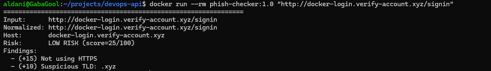

# Phish Checker (Heuristic URL Risk Analyzer)

A lightweight Python CLI tool that analyzes URLs and assigns a phishing-risk score (0–100) with explainable reasons.

## What it checks
- HTTPS vs HTTP
- URL shorteners (bit.ly, t.co, etc.)
- IP address as hostname
- Too many subdomains
- Punycode / IDN lookalikes
- Suspicious TLDs (e.g., .xyz)
- '@' trick inside URL
- Redirect-style query parameters
- Brand impersonation heuristic

## Scoring rules (high level)

The tool adds points when it detects common phishing red flags.  
Higher score = more suspicious (0–100).

Examples:
- Not using HTTPS: +15
- URL shortener domain: +25
- IP address as hostname: +25
- Many subdomains (>=3): +20
- Punycode lookalike domain: +20
- “@” in URL: +25
- Suspicious TLD (e.g., .xyz): +10
- Brand impersonation likely: +25
- Redirect parameter in query: +15


## How to run (WSL / Linux)
```bash
python3 phish_Checker.py https://example.com
python3 phish_Checker.py "paypal-login.verify-account.xyz/login"
```


## Run with Docker

Build the image:
```bash
docker build -t phish-checker:1.0 .
```s

Run the container:
```bash
docker run --rm phish-checker:1.0 "http://docker-login.verify-account.xyz/signin"
```




## Help / CLI options
```bash
python3 phish_Checker.py --help
Example:
```bash
usage: phish_checker [-h] urls [urls ...]

Heuristic phishing-risk analyzer for URLs.

positional arguments:
  urls        One or more URLs to analyze.

options:
  -h, --help  show this help message and exit
