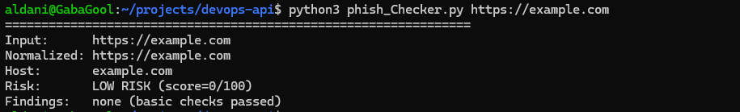
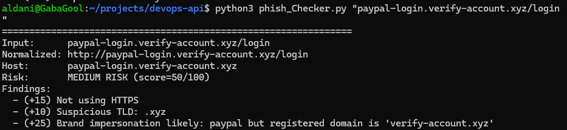

# Phish Checker (Heuristic URL Risk Analyzer)

A lightweight Python CLI tool that analyzes URLs and assigns a phishing-risk score (0–100) with explainable reasons.

## What it checks
- HTTPS vs HTTP
- URL shorteners (bit.ly, t.co, etc.)
- IP address as hostname
- Too many subdomains
- Punycode / IDN lookalikes
- Suspicious TLDs (e.g., .xyz)
- '@' trick inside URL
- Redirect-style query parameters
- Brand impersonation heuristic

## How to run (WSL / Linux)
```bash
python3 phish_Checker.py https://example.com
python3 phish_Checker.py "paypal-login.verify-account.xyz/login"
```

## How to run with Docker
```bash
docker build -t phish-checker .
docker run --rm phish-checker https://example.com
docker run --rm phish-checker "paypal-login.verify-account.xyz/login"
```

You can also analyze multiple URLs in one command:
```bash
docker run --rm phish-checker https://example.com https://bit.ly/test
```

## Example output



